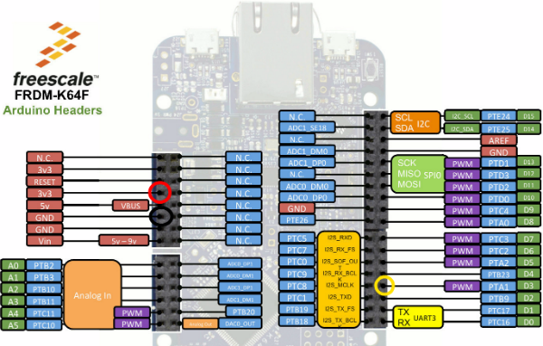

# *XYZ* - Making music on a microcontroller - Instructions

Welcome to our session at *XYZ*! If you have any questions, please just give a shout. We are here to help.

In this session we'll work through six examples together. We will demonstrate everything, but this document should help you in case you're stuck. We also have optional exercises in case you want to go further.

> If you happen to be much faster than everyone else, help your neighbors.

## Setup

1. Connect the *Microcontroller name* board to your computer. *If more instructions are needed, add them here (for example, which USB connection to use).*
1. The board mounts as a mass-storage device (like a USB drive). Verify that you can see it (the drive name will be MBED).
1. Go to [http://developer.mbed.org](http://developer.mbed.org).
1. Create an ARM mbed account if you do not have one.
1. On the top right corner, click the Compiler button.
1. An IDE should open. Congratulations!

**On Windows:** To see debug messages, install the serial driver. (Note: this should be done already on the NXP laptops provided for FTF labs)

**Debug messages:** We can talk to the board via a serial port, but you might need some software. Read [this doc](https://developer.mbed.org/handbook/SerialPC#host-interface-and-terminal-applications) and install the listed software (like PuTTY or Tera Term on Windows).

**Local development:** If you like things locally, you can do so by using [mbed CLI](https://docs.mbed.com/docs/mbed-os-handbook/en/5.1/getting_started/blinky_cli/#installing-mbed-cli-and-a-toolchain). I very much recommend to just use the online IDE, as it makes it easier for us, but if you want to continue hacking in the future, this is a nice way.

## 1. Blinky

1. First we need to set up our project and our target. Go to *[link to microcontroller platform page]()* and click the **Add to your mbed Compiler** button.
1. Go back to the compiler browser window and refresh the page.
1. Click the Import button, then click **Click Here to import from URL**.
1. Paste the following URL: *Your fork of the eiab-making-music repository*.
1. Click the **Import** button.
1. In the top right corner, verify that the right development board is selected.

Next, we will select which program we will build. This step needs to be repeated every time we progress to the next example.

1. In the tree, locate 'select_project.h'.
1. Change the number in this file to the project you want to build. In this case `1`.

Now we can implement the code to make the LED on your development board blink. Open ``1_blinky/main.h`` and under 'YOUR CODE HERE' add the following code:

```cpp
static void blinky() {
    // the LED is either on or off (a 1 or a 0). We can inverse the value with the `!` (inverse operator).
    // the flipped value is what we write back to the LED, thus toggling the LED.
    myled = !myled;
}
```

1. Now press Compile.
1. A file downloads.
1. Drag the file to the 'MBED' disk.
1. The green LED next to the USB cable will flash.
1. *If more instructions are needed (for example, pressing the RESET button), add them here.*
1. Blinky runs!

**Optional:** We use [Ticker](https://developer.mbed.org/handbook/Ticker) to periodically run the blinky function. You could also use [Timeout](https://developer.mbed.org/handbook/Timeout) to run a function after a specified delay. Rewrite the code so that it uses the Timeout class. Afterwards see if you can vary the time between blinks ([hint](http://www.cplusplus.com/reference/cstdlib/rand/)).

## 2. Two buttons, two LEDs

1. In 'select_project.h' change the number to `2`.
1. Open ``2_two_buttons/main.h``.
1. We want to execute a function when the button is pressed.
1. We already have code in place which responds when the buttons 'fall', which means the button is pressed.
1. Let's write a similar function as before, but now with two functions (one for both LEDs on your development board).
1. Under 'YOUR CODE HERE' add the following code:

```cpp
static void toggle_one() {
    led1 = !led1;
}
static void toggle_two() {
    led2 = !led2;
}
```

1. Press the **Compile** button and flash the application. Clicking on Button 1 and Button 2 will now toggle the LEDs.

**Optional 1:** We use `fall` currently, which triggers when the button is clicked. We can also use `rise` to get an event when the button is no longer clicked. Change the code so that the LEDs only burn when the button is pressed down.

**Optional 2:** When we start a periodic timer with a ticker, we can cancel the timer as well via:

```cpp
<name_of_ticker>.detach();
```

Use the above pattern in combination with 'Optional 1'. Start the blinking when a button is pressed, then stop the blinking when the button is pressed a second time.

## 3. Sound instead of color

1. In 'select_project.h' change the number to `3`.
1. Open ``3_sound/main.h``.
1. We have a buzzer, which we can use instead of the color as an output.
1. If the buzzer is not yet connected to your board, connect it. See lab staff 1or help.
1. We use pulse width modulation to create the square waves, the buzzer is 1onnected to pin 3.
1. We have a `play_tone` function, now let's hook it up...
1. Under 'YOUR CODE HERE' add the following code:

```cpp
static void play_note1() {
    play_tone(NOTE_C4, 200);
}
static void play_note2() {
    play_tone(NOTE_D4, 200);
}
```

1. Press the **Compile** button and flash the application. When hitting the buttons you'll now get sound (a C and a D tone).
1. Try and play with different tones and tone lengths.

**Optional:** Currently tones have fixed length. Change the code to play a tone when the button fall's, and call silence when button rise's. This should give you the ability to play some small (two-tone) songs. The next example project, '4_accelerometer', will provide hints.

### Connecting the buzzer

If you disconnected the buzzer by accident, no worries! Here's how you reconnect it:

.

*Replace this image with the pinout of the development board used. Also adjust the text below.*

Your buzzer has four pins (red, black, yellow and white). Plug the red, black and yellow cables in according to the schema above (white is unused). Always use the outer lane on the board, not the inner pins.

red=3.3V, black=GND, yellow=D3.

## 4. More inputs

*This section assumes the built-in NXP FRDM-K64F, alter based on the development board used in the session.*

1. In 'select_project.h' change the number to `4`.
1. Open ``4_accelerometer/main.h``.
1, We're going to use the accelerometer movement detector to play a sound too, this means we can knock the board on a table and get a sound.
1. A new library is included which does this for you already.
1. At the bottom of main.cpp you'll see initialization logic for the accelerometer.
1. When the accelerometer triggers (movement detected), we can execute some code again.
1. Under 'YOUR CODE HERE' add the following code:

```cpp
static void play_note3() {
    play_tone(NOTE_E4);

    tone_timeout.attach(&silence, 0.2); // setup tone_timeout to call silence after 200 duration ms
}
```

1. We manually call `silence` now to get predictable behavior.
1. Try and change the code to use `accel_interrupt_pin.rise` to silence instead (remove the timeout call from play_note3 as well). See what it does.
1. Change the notes and play some simple melodies.

**Optional:** You can read the data from the accelerometer (x, y, z axis) via:

```cpp
static void read_accel() {
    SRAWDATA accel_data;
    SRAWDATA magnet_data;
    accel.get_data(&accel_data, &magnet_data);

    // this will show up in PuTTY
    printf("x=%d y=%d z=%d\r\n", accel_data.x, accel_data.y, accel_data.z);
}
```

Use a ticker to read the data every 10 ms., then use the value from the accelerometer (e.g. `accel_data.z`) and feed it into `play_tone` function. We can now change the sound depending on how you hold the device in physical space. Allow to pause the sound by pressing one of the buttons.

You can play with the distribution of the tone. Just feeding the raw data into the algorithm doesn't generate the nicest effect.

## 5. Songs

1. In 'select_project.h' change the number to `5`.
1. Open ``5_songs/main.h``.
1. We can play tones from various inputs, but we could also play songs that we program in beforehand.
1. We create a simple format to write notes (in the `main` function).
1. Now we need to write the code that will play this format.
1. Our `play_song` function takes 3 arguments:
    * The number of notes left
    * The notes left (as a pointer)
    * The durations left (as a pointer)
1. Every time we play a note we subtract 1 from the notes left, and up the notes and durations. When we reach 0 we're done.
1. We add a pause between each note as well.
1. Under 'YOUR CODE HERE' insert:

```cpp
   // melody and duration are pointers, they point to the array of tones and durations we declared earlier
    // every time we play a note we up these pointers (move one element forward)
    // so the current tone is always the first element of melody (same for duration)

    int length;

    while(notes_left > 0)
    {

        int tone = melody[0];
        // BPM is quarter notes per minute, so length in milliseconds is:
        length = static_cast<int>(static_cast<float>(1000 / duration[0]) * (60000.0f / static_cast<float>(BPM * 1000)));

        play_tone(tone);

        // after half the length of this tone, we silence
        wait_ms(length / 2);
        silence();

        //after the full length of this tone, call next note
        wait_ms(length);

        // after the full length of this tone, we up the melody, and down the notes_left

        notes_left--;
        melody++;
        duration++;

    }

    // we're done! just finish this note and silence
    wait_ms(length / 2);
    silence();
```

1. Delete the pause between the notes, what do you hear?
1. Find some melody and program it in, make some of your own music. Play with the BPM as well to speed things up or slow things down.

**Optional:** Add some LED effects whenever songs are playing. Toggle the built-in LEDs depending on the tone, or attach some external (tri-color?) LEDs to the development board to spice things up.

## 6. Songs from the cloud

Currently all the songs live in the firmware of the device, and are hard coded. We can use ARM mbed Device Connector to connect our device to the internet, and store the songs in the cloud instead.

To connect a device to mbed Device Connector, we need to get a certificate for the device:

1. Go to https://connector.mbed.com/, and sign in with your ARM mbed account.
1. Click on 'Security Credentials' and click 'Get my Security Credentials'.
1. Copy everything in the gray box.
1. Open the file ``6_songs-from-the-cloud/security.h`` and paste in the content.

Now we can change the code that we wrote before, to use 'cloud variables' instead of local variables.

1. In 'select_project.h' change the number to `6`.
1. Open ``6_songs-from-the-cloud/main.h``.
1. Under 'YOUR CODE HERE' insert:

```cpp
static vector<int>* parse_pattern(SimpleResourceString value) {
    // the format is 4:4:4:4, so we need to split the string and turn them into a vector
    vector<int>* buffer = new vector<int>();
    stringstream ss(value);
    string item;
    while (getline(ss, item, ':')) {
        buffer->push_back(atoi(item.c_str()));
    }
    return buffer;
}

static void play_song_cloud(void*) {
    printf("play_song_cloud function is called\n");

    // we can just read the cloud variables, they are automatically synced
    vector<int>* notesVector = parse_pattern(notes);
    vector<int>* durationVector = parse_pattern(duration);

    if (notesVector->size() != durationVector->size()) {
        printf("notes and duration have different size... aborting %d vs. %d", notesVector->size(), durationVector->size());
        return;
    }

    play_song(notesVector, durationVector);

    free(notesVector);
    free(durationVector);
}
```

1. After you flash the program LED1 will blink while the board tries to connect to the internet. When the connection is successful the LED will stop blinking (and turn on).

### Controlling the device from the cloud

1. Your device now lists under https://connector.mbed.com/#endpoints.
1. Through the API Console you can talk to the device.
1. In the API Console, select **Endpoint directory lookups > POST**.
1. Select your endpoint, and under 'resource-path' select ``/buzzer/0.play``.
1. Click **TEST API**. Your device will start playing.

### A web app to control your device

You can now start a web application that lets you send new songs to your development board.

1. Click on [this link](https://c9.io/auth/mbed?r=https%3A%2F%2Fc9.io%2Fopen%3FworkspaceType%3Dmbed%26clone_url%3Dhttps%3A%2F%2Fgithub.com%2FARMmbedl%2Feiab-making-music.git).
1. Choose 'ARM mbed' as the template and click 'Create Workspace'
Open `6_songs-from-the-cloud/web/server.js`.
1. We need an access key (API key). Go to https://connector.mbed.com/#accesskeys and get an access key.
1. In server.js, fill in the key on line 1 (between the quotes), so we'll get something like `var accessKey = 'ABCDEF';`.
1. In the tree, right click on the 'web' folder (under 6_songs-from-the-cloud) and choose 'Open terminal here'. A terminal window will open.
1. Type `node server.js` and hit enter.
1. After a few seconds a link will appear. Click on it, and select 'Open'.
1. A web page opens and your device will be there. Click on the device, and on the next page click 'Play'.
1. We can send new sounds to the board, f.e. via the 'Set Mario' button. Wait until you get an alert and press 'Play' again.
1. You can write some new songs from JavaScript (in ftf2016/6_songs-from-the-cloud/web/views/instrument.html) now.

**Optional:** Look into how we send values to the cloud. Add a way of setting the BPM from the web app as well.
